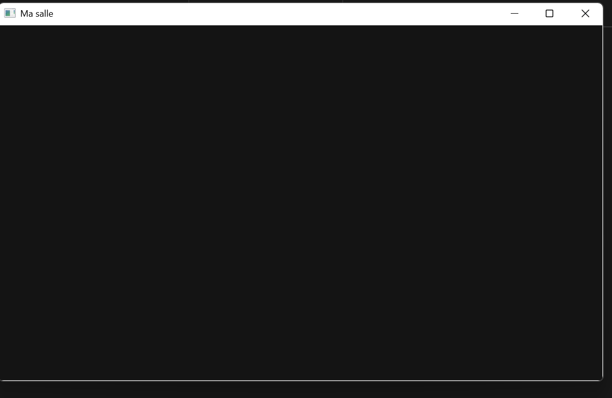

# Chapitre 3 - Exercice 1 : La fenêtre nue

## Ce que j'ai fait
Programme de quinze lignes (`src/main.cpp`) qui ouvre une fenêtre
1200x720 intitulée « Ma salle », construit avec Jenga (`ma_salle.jenga`)
et lancé depuis `build/Bin/Debug-Windows/MaSalle/MaSalle.exe`.

## Capture

## Temps passé
4.88s, du début de l'exercice (création des dossiers) jusqu'à
l'affichage de la fenêtre.

## Difficultés rencontrées
- Première compilation échouée : les classes du kit sont dans le
  namespace `nkentseu`, il fallait `using namespace nkentseu;`.
- Limite connue : le clic sur la croix ne ferme pas la fenêtre.
  La boucle `while (fenetre.IsOpen())` ne réagit pas à l'événement de
  fermeture. Je ne l'ai pas corrigé pour cet exercice. Il faudra étudier
  la gestion de `NkWindowCloseEvent`.

## Note
Les dossiers `include/` et `lib/` du kit sont copiés dans l'exercice mais
ne sont pas versionnés. Pour recompiler, il faut les copier depuis le kit.