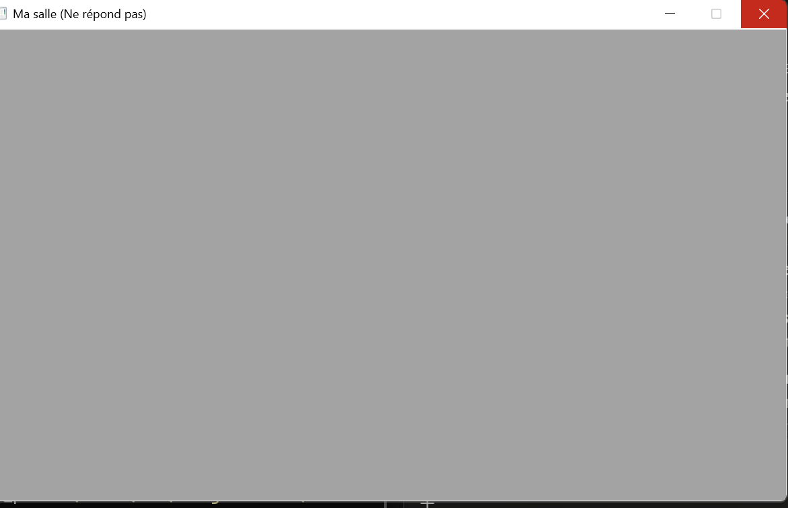

# Chapitre 3 - Exercice 2 : La fenêtre qui ne répond pas

## Ce que j'ai fait
J'ai commenté l'appel à `NkEvents().PollEvents()` dans la boucle
de `src/main.cpp`, puis lancé le programme, construit avec Jenga.

## Capture

## Temps mesuré
La fenêtre est devenue grise après 11,88 secondes (chronométré à la
main sur ma machine, depuis l'apparition de la fenêtre).

## Explication
Sans `PollEvents`, le programme ne lit jamais les messages envoyés
à la fenêtre (clics, déplacement, redessin). Windows voit que la
fenêtre ne répond pas à ces messages et finit par la déclarer
bloquée : le contenu devient gris.