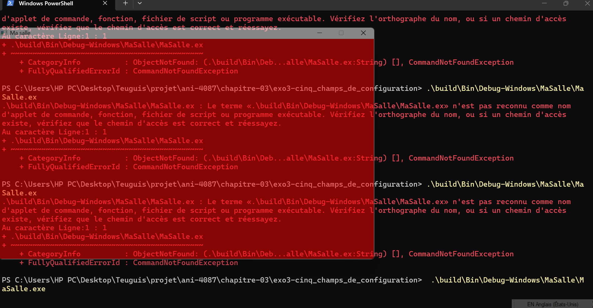

# Chapitre 3 - Exercice 3 : Cinq champs de configuration

Condition commune : `config.centered = false` (valeur par défaut `true`,
mis à `false` pour que `x` soit pris en compte).

Note : mes attentes ont été formulées avant le lancement du programme,
en discussion avec Claude, puis reprises ici.

Capture : 

## 1. x
Ligne : `config.x = 0;`
Attendu : la fenêtre se colle au bord gauche de l'écran. `y` garde sa
valeur par défaut (100), donc elle sera à 100 pixels du haut.
Incertitude : si le kit ignore `x` malgré `centered = false`, elle
restera centrée.
Observé : la fenêtre est complètement collée au bord gauche de l'écran.
Le champ `x` est donc pris en compte quand `centered = false`. Je n'ai
pas mesuré la position verticale.

## 2. resizable
Ligne : `config.resizable = false;`
Attendu : tirer sur un bord ne change plus la taille, et le bouton
agrandir est grisé ou absent.
Incertitude : le kit peut n'interdire que le tirage, pas le bouton.
Observé : en tirant sur un bord, la taille ne change pas. Sur la
capture, le bouton agrandir apparaît grisé, contrairement à réduire et
fermer. Le kit interdit donc à la fois le redimensionnement et
l'agrandissement.

## 3. bgColor
Ligne : `config.bgColor = 0xFF0000FF;`
Attendu : un fond rouge. Cette valeur est rouge en RGBA et en ABGR,
mais bleue en ARGB, donc la couleur obtenue indiquera le format.
Incertitude : ma boucle ne dessine rien, donc le fond peut rester blanc
ou gris si le kit n'applique la couleur qu'au rendu.
Observé : le fond est rouge. Le format n'est donc pas ARGB. Je ne peux
pas distinguer RGBA de ABGR avec cette valeur. La couleur est appliquée
même sans que mon programme dessine quoi que ce soit.

## 4. opacity
Ligne : `config.opacity = 0.5f;`
Attendu : la fenêtre entière, barre de titre comprise, est à moitié
transparente, et on voit le bureau ou les autres fenêtres à travers.
Observé : on voit les icônes et le fond d'écran à travers la fenêtre,
et la barre de titre est elle aussi translucide. L'opacité s'applique à
toute la fenêtre, comme prévu.

## 5. alwaysOnTop
Ligne : `config.alwaysOnTop = true;`
Attendu : quand je clique sur une autre fenêtre (le terminal, par
exemple), la nôtre reste affichée au-dessus.
Observé : quand je clique sur une autre fenêtre, « Ma salle » reste
devant. Conforme à l'attente.